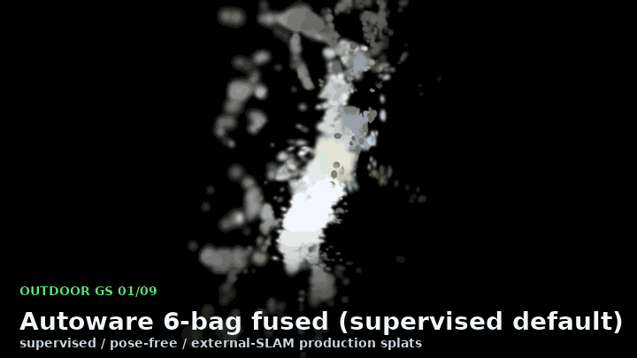
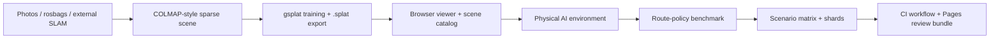
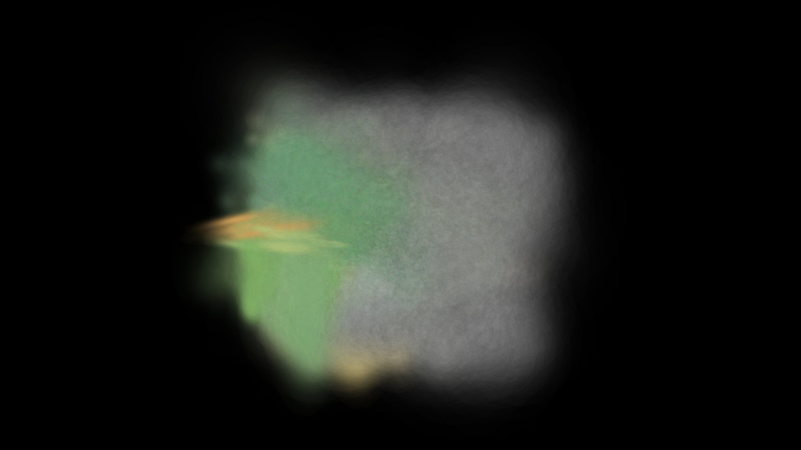
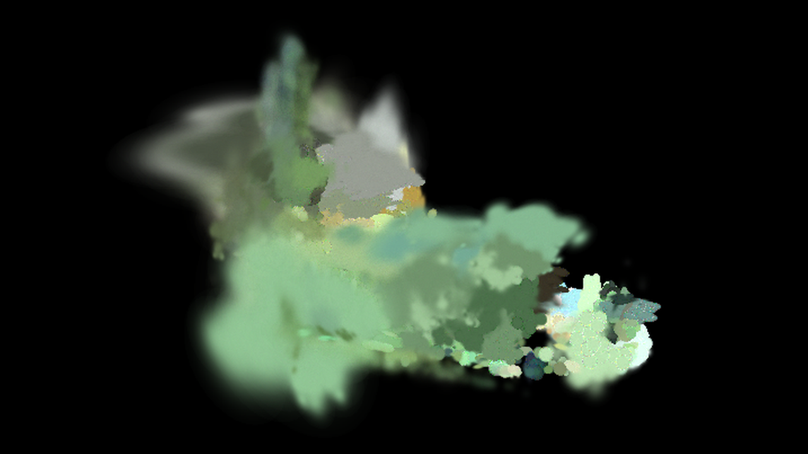
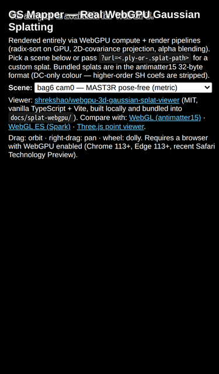

# GS Mapper

[](https://github.com/rsasaki0109/gs-mapper/actions/workflows/ci.yml)
[](https://rsasaki0109.github.io/gs-mapper/)
[](LICENSE)
[](pyproject.toml)
[](https://github.com/rsasaki0109/gs-mapper/commits/main)

**Turn real outdoor robot data into Gaussian-splat scenes, Physical AI policy benchmarks, and CI review artifacts.**

```bash
git clone https://github.com/rsasaki0109/gs-mapper.git
cd gs-mapper
pip install -e ".[dev]"

# Fast visual proof: photos -> .splat -> browser viewer
gs-mapper photos-to-splat --images ./my_photos --output outputs/my_splat

# Simulation catalog proof: public 3DGS scenes -> Physical AI scene contract
python3 scripts/generate_sim_catalog.py --output docs/sim-scenes.json
```

Open first: [live splat viewer](https://rsasaki0109.github.io/gs-mapper/splat.html),
[Spark mobile / VR viewer](https://rsasaki0109.github.io/gs-mapper/splat_spark.html),
[WebGPU viewer](https://rsasaki0109.github.io/gs-mapper/splat_webgpu.html), and
[Physical AI contract](docs/physical-ai-sim.md).

Star/watch this repo if you want updates on real-world robotics logs becoming
browser-viewable 3DGS scenes, route-policy benchmark artifacts, and reviewable
scenario CI gates.

[](https://rsasaki0109.github.io/gs-mapper/splat.html)

GS Mapper is the glue layer between modern visual geometry front-ends and
Physical AI evaluation workflows. It can run DUSt3R / MASt3R pose-free
preprocessing, import MASt3R-SLAM / VGGT-SLAM 2.0 / Pi3 / LoGeR artifacts as
external pose data, train with gsplat, export browser-ready `.splat` files, and
wrap those scenes in route-policy benchmark and scenario-CI artifacts.

What makes it different:

- **Real data first**: robotics logs, outdoor photos, and external SLAM outputs
  are first-class inputs.
- **Scene artifacts are inspectable**: every production splat opens in the
  bundled WebGL / Spark / WebGPU viewers.
- **Policy evaluation is part of the repo**: scene contracts, observations,
  collision checks, route-policy baselines, imitation benchmarks, history gates,
  scenario sets, matrix expansion, sharding, CI manifests, workflow validation,
  activation, and review bundles are split into testable modules.
- **CI is designed as a product surface**: benchmark execution is broken into
  small shardable artifacts instead of one giant opaque end-to-end job.



Project notes: [Physical AI sim contract](docs/physical-ai-sim.md),
[outdoor pipeline handoff](docs/plan_outdoor_gs.md), [launch kit](docs/launch-kit.md),
release notes [v0.1.0](docs/releases/v0.1.0.md).

The repo ships **eight** production demo scenes that A/B-compare pose-free and
external-SLAM outputs against supervised GNSS + LiDAR baselines. Pick any scene
from the dropdown in the [live viewer](https://rsasaki0109.github.io/gs-mapper/splat.html).
The old MCD `tuhh_day_04` zero-GNSS artifact is retained only as a diagnostic
file in this branch, not as a production picker item.

Table thumbnails are **full-canvas grabs** from `splat.html` (UI chrome hidden)
so they stay readable when GitHub scales them down. The table, hero GIF,
preview capture script, and viewer pickers are checked against
`docs/scenes-list.json`. Regenerate with
`DISPLAY=:0 python3 scripts/capture_readme_splat_previews.py` after adding or
changing a `.splat` (requires Playwright + GPU-backed WebGL).

ロボティクス・自動運転データセット、写真フォルダ、外部 SLAM の出力から
3D Gaussian Splatting の学習、Web ビューア、Physical AI policy benchmark
までをつなぐツールです。Python モジュール名は `gs_sim2real` のまま維持し、
旧 CLI の `gs-sim2real` も互換エイリアスとして残します。

## Quickstart — pick your entry point

The repo has three independent entry points depending on what you already have.
Pick one and follow the linked deep-dive — they do not stack on top of each
other, so there is no need to read the others first.

| What you start with | Minimum command | Deep-dive section |
| --- | --- | --- |
| **A folder of photos** (no poses, no rosbag, no external SLAM) | `gs-mapper photos-to-splat --images ./my_photos --output outputs/my_splat` | [Bring Your Own Photos](#bring-your-own-photos-one-shot-pose-free) |
| **External SLAM artifacts** from a MASt3R-SLAM / VGGT-SLAM 2.0 / Pi3 / LoGeR run | `python3 scripts/plan_external_slam_imports.py --format shell` then `gs-mapper preprocess --method external-slam …` | [Import External SLAM Results](#import-external-slam-results) |
| **Physical AI scene + policy evaluation** (you already have splats and want benchmarks) | `python3 scripts/generate_sim_catalog.py --output docs/sim-scenes.json` then `gs-mapper route-policy-benchmark …` | [Physical AI benchmark path](#physical-ai-benchmark-path) |

Full rosbag → supervised outdoor splat (Autoware Leo Drive, MCD) is a fourth
path in [Outdoor pipeline quickstart](#outdoor-pipeline-quickstart-autoware-leo-drive).
Generic CLI step-by-step (download / preprocess / train / export) lives in
[CLI reference](#cli-reference) at the bottom.

## Physical AI benchmark path

The public splat scenes double as versioned Physical AI simulation inputs.
Start with the scene catalog, then run policy benchmarks and scale them
into a scenario CI pipeline that builds, validates, and activates its own
GitHub Actions workflow.

The chain layers on top of each other:

- **Scene catalog** — `scripts/generate_sim_catalog.py` keeps
  `docs/sim-scenes.json` synchronized with the public viewer picker.
- **Route policy benchmark** — `gs-mapper route-policy-benchmark` runs a
  policy registry against a goal suite in a seeded headless environment
  and emits a PASS / FAIL report.
- **Scenario matrix + shards + merge** — split a Cartesian product of
  registries × scenes × goal suites × configs into CI-sized shards; each
  shard is still a normal scenario set, so CI jobs run with the existing
  `route-policy-scenario-set` command. A merge job rebuilds a single
  history gate from all shard outputs.
- **Scenario CI workflow generator + guardrails** — `route-policy-scenario-ci-manifest`
  produces a manifest, `route-policy-scenario-ci-workflow` materializes a
  GitHub Actions YAML, `route-policy-scenario-ci-workflow-validate`
  checks the generated YAML against the manifest, and
  `route-policy-scenario-ci-workflow-activate` writes it to a guarded
  path under `.github/workflows/`.
- **Review bundle + promotion + adoption** — `route-policy-scenario-ci-review`
  publishes a Pages review bundle (JSON / Markdown / HTML) with per-shard
  status, validation checks, activation state, and an optional adopted
  workflow diff; `route-policy-scenario-ci-workflow-promote` gates the
  promotion from manual-only dispatch to repository triggers, and
  `route-policy-scenario-ci-workflow-adopt` re-materializes a
  trigger-enabled workflow to a separate active path so the manual YAML
  stays reviewable alongside it.
- **Partial-information benchmarks** — `RoutePolicySensorNoiseProfile`
  perturbs the observed pose / goal with a deterministic seeded Gaussian,
  and `DynamicObstacleTimeline` layers waypointed sphere obstacles on
  top of the scene so a benchmark run can stress a policy under sensor
  noise, moving obstacles, or both; the gym adapter's feature dict gets a
  `nearest-dynamic-obstacle-*` block for obstacle-aware policies.

```bash
# Keep the Physical AI scene catalog synchronized with the public viewer picker.
python3 scripts/generate_sim_catalog.py --output docs/sim-scenes.json

# Evaluate a pinned policy registry against fixed goals.
gs-mapper route-policy-benchmark \
  --policy-registry runs/scenarios/outdoor-policies.json \
  --goal-suite runs/scenarios/outdoor-goals.json \
  --scene-catalog docs/scenes-list.json \
  --scene-id outdoor-demo \
  --episode-count 16 \
  --output runs/scenarios/outdoor-policy-benchmark.json \
  --markdown-output runs/scenarios/outdoor-policy-benchmark.md

# Scale benchmark definitions into CI-sized shards and a reviewable workflow.
gs-mapper route-policy-scenario-matrix \
  --matrix runs/scenarios/outdoor-matrix.json \
  --output-dir runs/scenarios/generated \
  --index-output runs/scenarios/matrix-expansion.json
gs-mapper route-policy-scenario-shards \
  --expansion runs/scenarios/matrix-expansion.json \
  --max-scenarios-per-shard 4 \
  --output-dir runs/scenarios/shards \
  --index-output runs/scenarios/shard-plan.json
gs-mapper route-policy-scenario-ci-manifest \
  --shard-plan runs/scenarios/shard-plan.json \
  --output runs/scenarios/ci-manifest.json

# One-minute smoke that exercises matrix -> shard -> ... -> adoption -> review
# on a tiny fixture so regressions surface before the full GitHub Actions run.
PYTHONPATH=src python3 scripts/smoke_route_policy_scenario_ci.py
```

See [docs/physical-ai-sim.md](docs/physical-ai-sim.md) for the full
matrix -> shard -> manifest -> generated workflow -> validation ->
activation -> Pages review bundle -> promotion -> adoption chain, plus
sensor noise profiles, dynamic obstacles, and the obstacle-aware
observation feature block.

## Live Demo

GitHub Pages hosts four views of the same 6-bag Autoware Leo Drive ISUZU bundle:

| URL | Renderer | Notes |
|-----|----------|-------|
| [`/`](https://rsasaki0109.github.io/gs-mapper/) | `THREE.PointsMaterial` (WebGL) | Three.js point viewer, draws gaussian centres as soft-disc sprites. Widest browser support. |
| [`/splat.html`](https://rsasaki0109.github.io/gs-mapper/splat.html) | `antimatter15/splat` (WebGL2, CPU sort) | Lightest real splat renderer, vendored as a single JS file. |
| [`/splat_spark.html`](https://rsasaki0109.github.io/gs-mapper/splat_spark.html) | `sparkjsdev/spark` 2.0 (WebGL2, ESM) | THREE.js-based World Labs renderer with view-dependent LoD, progressive streaming, and VRAM virtualization. Handles mobile / VR as well as desktop; an **Enter VR** button is wired up for WebXR-capable devices (Meta Quest / Vision Pro). Ships its own scene picker. |
| [`/splat_webgpu.html`](https://rsasaki0109.github.io/gs-mapper/splat_webgpu.html) | `shrekshao/webgpu-3d-gaussian-splat-viewer` (WebGPU, GPU radix sort) | True WebGPU: compute-shader preprocess + radix sort per frame. Requires Chrome 113+, Edge 113+, or Safari TP with WebGPU enabled. |

`splat.html` ships a scene picker across **two** supervised splats (Autoware fused and MCD `ntu_day_02`), **four** pose-free variants, and **two** external-SLAM artifact comparison scenes. Each shipped pose-free / external-SLAM `.splat` and the MCD supervised splat are capped at a 400k-gauss / 12.8 MB antimatter15 binary; the default Autoware supervised scene uses a smaller 80k gauss export for faster first paint (see table footnote).

| Scene | Preview | Pipeline |
|-------|---------|----------|
| Autoware 6-bag fused (supervised default) | [](https://rsasaki0109.github.io/gs-mapper/splat.html?url=assets/outdoor-demo/outdoor-demo.splat) | GNSS + `/tf_static` + LiDAR-seeded COLMAP, image-projected RGB init, gsplat 30-50k iter, LiDAR depth + appearance + 6-DOF BA |
| bag6 cam0 — DUSt3R pose-free | [](https://rsasaki0109.github.io/gs-mapper/splat.html?url=assets/outdoor-demo/outdoor-demo-dust3r.splat) | 20 image-only frames → DUSt3R pointmap + global align → gsplat 3k iter |
| MCD tuhh_day_04 — DUSt3R pose-free | [](https://rsasaki0109.github.io/gs-mapper/splat.html?url=assets/outdoor-demo/mcd-tuhh-day04.splat) | 20 color frames of a non-Autoware MCD day handheld session → DUSt3R → gsplat 3k iter |
| bag6 cam0 — MAST3R pose-free (metric) | [](https://rsasaki0109.github.io/gs-mapper/splat.html?url=assets/outdoor-demo/bag6-mast3r.splat) | Same 20 frames → MAST3R sparse global alignment → gsplat **15k** iter. Metric-scale, 20/20 non-degenerate poses. See [Quality push](#quality-push-3k-vs-15k-mast3r-training) for the before/after |
| bag6 cam0 — VGGT-SLAM 2.0 (15k) | [](https://rsasaki0109.github.io/gs-mapper/splat.html?url=assets/outdoor-demo/bag6-vggt-slam-20-15k.splat) | Same 20 frames → VGGT-SLAM 2.0 in an isolated env → `external-slam` artifact import → gsplat **15k** iter. Comparison-quality rather than the default demo |
| bag6 cam0 — MASt3R-SLAM (15k) | [](https://rsasaki0109.github.io/gs-mapper/splat.html?url=assets/outdoor-demo/bag6-mast3r-slam-20-15k.splat) | 20 stride-2 frames → official MASt3R-SLAM in an isolated env → `external-slam` artifact import → gsplat **15k** iter. Comparison-quality; 10/20 candidates became tracked keyframes |
| MCD tuhh_day_04 — MAST3R pose-free (metric) | [](https://rsasaki0109.github.io/gs-mapper/splat.html?url=assets/outdoor-demo/mcd-tuhh-day04-mast3r.splat) | Same frames → MAST3R → gsplat **15k** iter. Matrix completes {bag6, MCD} × {DUSt3R, MAST3R} |
| MCD ntu_day_02 — supervised | [](https://rsasaki0109.github.io/gs-mapper/splat.html?url=assets/outdoor-demo/mcd-ntu-day02-supervised.splat) | ATV session with valid `/vn200/GPS` after warm-up trim → ATV calibration YAML → LiDAR-seeded COLMAP sparse + depth-supervised gsplat 30k iter |

The Autoware supervised default uses the full multi-bag pose-import stack. The MCD supervised row uses `ntu_day_02` because `tuhh_day_04` publishes all-zero GNSS; that rejected zero-GNSS artifact remains documented in `docs/plan_outdoor_gs.md`. Pose-free variants use the pipeline you can invoke yourself with `gs-mapper photos-to-splat --preprocess dust3r` or `--preprocess mast3r`.

Before running GNSS-seeded MCD preprocessing on a new session, run `scripts/check_mcd_gnss.py <session-dir> --gnss-topic /vn200/GPS` and require non-zero fixes plus a non-trivial ENU trajectory extent.

### Mobile

Spark 2.0 is built for mobile / VR as well as desktop and the scene picker reflows cleanly on a phone-sized viewport. Dogfooded via Playwright with the iPhone 14 device profile (390×664, DPR 3) against the live Pages site — scene picker, blurb, and canvas all fit and the `?url=...` deep links keep working:



Open the live demo on your phone: [splat_spark.html](https://rsasaki0109.github.io/gs-mapper/splat_spark.html), [splat.html](https://rsasaki0109.github.io/gs-mapper/splat.html), or [splat_webgpu.html](https://rsasaki0109.github.io/gs-mapper/splat_webgpu.html) (WebGPU viewer needs Chrome / Edge 113+ or recent Safari TP).

### Quality push: 3k vs 15k MAST3R training

Pose-free MAST3R variants are trained 5× longer than the DUSt3R ones because the sparse MAST3R seed (~300k confidence-matched descriptors) can actually absorb the extra iterations. At 3k iter gsplat has 767k gauss with visible gaps in surfaces; at 15k iter it converges to 923k gauss with sharper structure — L1 drops from ~0.18 to ~0.16 and the canvas looks noticeably less blobby.

| 3k iter (767k gauss) | 15k iter (923k gauss, shipped) |
|----------------------|--------------------------------|
|  |  |

DUSt3R variants are kept at 3k iter because their aligner output saturates earlier (no extra descriptor signal for later iterations to exploit).

### Benchmark (this repo, bundled demos)

Numbers below are the end-to-end wall-clock and quality figures for the production bundled splats, measured on a single RTX 4070 Ti Super (16 GB). The "Pose → sparse" column is pose-free backend run time on 20 frames with `scene_graph=complete` or the supervised import path. "Train" is `gs-mapper train` on that sparse output. Supervised Autoware figures are from the multi-bag pose-import training that produces `outdoor-demo.splat`. The rejected MCD `tuhh_day_04` GNSS attempt is excluded because its `/vn200/GPS` bag contains only all-zero fixes.

| Scene | Pose → sparse | Recovered poses | Scene extent | gsplat iter | Train wall-clock | Trained gauss | Final L1 | Shipped splat |
|-------|---------------|-----------------|--------------|-------------|------------------|---------------|----------|----------------|
| Autoware 6-bag (supervised) | GNSS + `/tf_static` + LiDAR seed (6120 cams across 6 bags) | 6120/6120 | metric (bag-fused ENU) | 30 000 | ~hours | 1.48M → 80k filter | ~0.06 | 2.56 MB / 80k gauss |
| bag6 cam0 — DUSt3R | ~3 min | 19 / 20 | 1.02 m (unscaled) | 3 000 | 276 s | 5.57M → 400k filter | ~0.18 | 12.8 MB / 400k gauss |
| bag6 cam0 — MAST3R | ~3 min | **20 / 20** | **28.1 m (metric)** | 15 000 | 285 s | 923k | ~0.16 | 12.8 MB / 400k gauss |
| bag6 cam0 — VGGT-SLAM 2.0 | external run + artifact import | **20 / 20** unique poses | 3.23 m trajectory | 15 000 | 190 s | 222k | not tracked | 6.6 MB / 214k gauss |
| bag6 cam0 — MASt3R-SLAM | external run + artifact import | **10 / 20** keyframes | 2.16 m trajectory | 15 000 | 460 s | 1.34M → 400k filter | ~0.24 | 12.8 MB / 400k gauss |
| MCD tuhh_day_04 — DUSt3R | ~3 min | 19 / 20 | 1.78 m (unscaled) | 3 000 | 147 s | 3.23M → 400k filter | ~0.18 | 12.8 MB / 400k gauss |
| MCD tuhh_day_04 — MAST3R | ~5 min | **20 / 20** | **59.0 m (metric)** | 15 000 | 413 s | 1.15M | ~0.16 | 12.8 MB / 400k gauss |
| MCD ntu_day_02 — supervised | GNSS + ATV calibration + LiDAR seed (400 cams after 35 s trim) | 400/400 | 250 m horizontal GNSS extent | 30 000 | 500 s | 906k → 400k filter | 0.195 | 12.8 MB / 400k gauss |

Every production 400k `.splat` is capped at the antimatter15 400 000-gauss / 12.8 MB size via `gs-mapper export --format splat --max-points 400000`, which is well under what Chrome can stream over Pages on mobile. The **Autoware** supervised default uses a different filter budget (80k after opacity/scale gate) because its dense reconstruction already absorbs the supervised signal, and a smaller splat loads faster on the default scene.

GitHub Pages is deployed by [`.github/workflows/pages.yml`](.github/workflows/pages.yml) on `push` to `main`.

## Concept

```
Images --> Preprocessing --> 3DGS Training --> Web Viewer
  |          (COLMAP /        (gsplat /        (Three.js
  |           DUSt3R / MCD    nerfstudio)      + antimatter15/splat)
  |           pose-import)
  |
  +-- DUSt3R (pose-free, image-only, bundled)
  +-- CoVLA (driving)
  +-- MCD (campus)
  +-- Autoware Leo Drive ISUZU bags (outdoor driving)
```

## Supported Datasets

| Dataset | Type | Description | Pose |
|---------|------|-------------|------|
| [DUSt3R](https://github.com/naver/dust3r) | Pose-free 3DGS (bundled) | Pairwise pointmap network + PointCloudOptimizer global aligner, feeds into our gsplat trainer | Not required |
| [GGRt](https://github.com/lifuguan/GGRt_official) | Pose-free 3DGS (reference only) | Feed-forward generalizable renderer; upstream needs `diff-gaussian-rasterization-modified` (custom CUDA extension) and outputs gaussians in a non-PLY format. Not integrated in this repo — use `--preprocess dust3r` instead. | Not required |
| [CoVLA](https://github.com/tier4/CoVLA) | Driving scenes | Large-scale driving dataset with front camera images | COLMAP |
| [MCD](https://mcdviral.github.io/) | Campus rosbags | Multi-campus outdoor scenes with stereo, LiDAR, IMU | COLMAP / GNSS + `/tf_static` pose-import |
| Autoware Leo Drive ISUZU | Outdoor driving rosbag | Public multi-camera + LiDAR + GNSS/INS bags from Autoware Foundation | GNSS + `/tf_static` pose-import (see `configs/datasets.yaml`) |

## Installation

```bash
git clone https://github.com/rsasaki0109/gs-mapper.git
cd gs-mapper
pip install -e ".[dev]"
```

For nerfstudio backend:
```bash
pip install -e ".[nerfstudio]"
```

For gsplat backend:
```bash
pip install -e ".[gsplat]"
```

## Demo App

A browser-based Streamlit interface is available for the full 3DGS pipeline
(image upload, COLMAP preprocessing, training, 3D viewer, export).

```bash
pip install -e ".[app]"
streamlit run app.py
```

The app opens at `http://localhost:8501` with a sidebar for pipeline settings
and tabs for each stage of the workflow.

## GitHub Pages 3DGS Viewer

Export a trained PLY as a static scene bundle:

```bash
gs-mapper export \
  --model outputs/train/point_cloud.ply \
  --format scene-bundle \
  --output docs/assets/my-scene \
  --bundle-asset-format binary \
  --scene-id my-scene \
  --label "My Scene"
```

To publish the same PLY into the real WebGL splat viewer (`docs/splat.html`):

```python
from gs_sim2real.viewer.web_export import ply_to_splat

ply_to_splat(
    "outputs/train/point_cloud.ply",
    "docs/assets/my-scene/my-scene.splat",
    max_points=60000,
    normalize_target_extent=30.0,
    min_opacity=0.5,
    max_scale=2.0,
)
```

Open `https://<pages>/splat.html?url=assets/my-scene/my-scene.splat` after deploy.

## Bring Your Own Photos (one-shot, pose-free)

Drop a folder of JPG/PNG frames in, get a `.splat` out. Uses DUSt3R for
pose estimation (no COLMAP / GNSS / LiDAR required) and gsplat for
training. The resulting file is the same 32-byte-per-gauss format that
[`docs/splat.html`](https://rsasaki0109.github.io/gs-mapper/splat.html)
renders directly, so you can preview it locally or drop it into
`docs/assets/...` to ship as a Pages demo.

```bash
# Ensure a local DUSt3R clone is reachable (default /tmp/dust3r)
git clone --recursive https://github.com/naver/dust3r /tmp/dust3r
cd /tmp/dust3r && mkdir -p checkpoints && \
  wget -P checkpoints https://download.europe.naverlabs.com/ComputerVision/DUSt3R/DUSt3R_ViTLarge_BaseDecoder_512_dpt.pth
cd -

# One-shot: photos -> .splat (DUSt3R + gsplat + export all in one)
gs-mapper photos-to-splat \
    --images ./my_photos \
    --output outputs/my_photos_splat \
    --num-frames 20 \
    --iterations 3000
# writes outputs/my_photos_splat/my_photos.splat
```

Or if you already have a trained PLY and just need the splat format:

```bash
gs-mapper export \
    --model outputs/my_train/point_cloud.ply \
    --format splat \
    --output outputs/my_scene.splat \
    --max-points 400000 \
    --splat-normalize-extent 17.0 \
    --splat-min-opacity 0.02 \
    --splat-max-scale 2.0
```

Preview locally with `python -m http.server` from the repo root and open
`http://localhost:8000/docs/splat.html?url=<path-to-splat>`.

## Import External SLAM Results

If poses come from an external front-end such as MASt3R-SLAM, VGGT-SLAM 2.0,
LoGeR, or Pi3/Pi3X, keep those heavy dependencies outside this repo and import
their exported trajectory as data. `external-slam` accepts TUM/KITTI/NMEA
trajectories plus an optional `.ply` / `.npy` / `.pcd` point cloud, then writes
the COLMAP sparse model used by the normal training commands. Pi3/Pi3X returns
`camera_poses` in its model output, and LoGeR can write `--output_txt`; both can
be imported without linking those packages into this repo. Pose tensors can also
be passed as `--trajectory` when they are stored in `.npy`, `.npz`, `.pt`, or
`.pth` files with a `camera_poses` or `poses` array of camera-to-world matrices.
Pi3/LoGeR-style `.pt` or `.npz` containers with dense `points` plus optional
`conf` / `images` arrays can also be flattened into a `.npy` point-cloud seed
inside the import output directory.

| System | CLI key | Trajectory candidates | Point-cloud candidates | Preflight support |
|--------|---------|-----------------------|------------------------|-------------------|
| MASt3R-SLAM | `mast3r-slam` | `poses.txt`, `trajectory.txt`, `*.tum`, `*.txt` | `reconstruction.ply`, `map.ply`, `*.ply` | dry-run manifest, gate failure details, selected artifact trace |
| VGGT-SLAM 2.0 | `vggt-slam` | `poses.txt`, `trajectory.txt`, `*.tum`, `*.txt` | `*_points.pcd`, `points.pcd`, `*.ply`, `*.pcd` | dry-run manifest, gate failure details, selected artifact trace |
| Pi3 / Pi3X | `pi3` | `poses.*`, `camera_poses.*`, `prediction.npz`, `predictions.*`, `result.npz`, `outputs.npz`, `*.tum`, `*.txt` | `result.ply`, `points.*`, `points3d.*`, `pointcloud.*`, `prediction.npz`, `predictions.*`, `result.npz`, `outputs.npz` | dry-run manifest, pose tensor import, dense point tensor flattening |
| LoGeR | `loger` | `trajectory.txt`, `pred_traj.txt`, `poses.*`, `output_txt.txt`, `camera_poses.*`, `results.pth`, `output.*`, `result.*`, `*.tum`, `*.txt` | `points.*`, `points3d.*`, `pointcloud.*`, `predictions.*`, `results.*`, `output.*`, `result.*`, `*.ply`, `*.pcd` | dry-run manifest, pose tensor import, dense point tensor flattening |
| Generic external SLAM | `generic` | TUM/KITTI/NMEA text, `poses.*`, `camera_poses.*`, `prediction.*`, `result.*`, `output.*` | `points.*`, `pointcloud.*`, `map.ply`, `reconstruction.ply`, `*.ply`, `*.npy`, `*.pcd` | dry-run manifest, candidate-resolution trace |

Run the bundled preflight plan before spending GPU time on training:

```bash
python3 scripts/plan_external_slam_imports.py --format shell > /tmp/external_slam_preflight.sh
bash /tmp/external_slam_preflight.sh
python3 scripts/collect_external_slam_imports.py --format markdown
```

```bash
gs-mapper preprocess \
  --images ./frames \
  --output outputs/external_colmap \
  --method external-slam \
  --external-slam-system loger \
  --external-slam-output outputs/loger_run \
  --trajectory trajectory.txt \
  --pointcloud points.ply \
  --pinhole-calib camera.json

gs-mapper train --data outputs/external_colmap --output outputs/external_train \
  --method gsplat --iterations 30000
```

## Outdoor pipeline quickstart (Autoware Leo Drive)

Download a public bag, preprocess with pose-import + image-projected RGB + LiDAR depth maps, train with depth supervision:

```bash
python3 scripts/download_datasets.py --dataset autoware_leo_drive_bag2 --dest data/

gs-mapper preprocess \
  --images data/autoware_leo_drive_bag2 \
  --output outputs/bag2 \
  --method mcd \
  --image-topic "/lucid_vision/camera_0/raw_image,/lucid_vision/camera_1/raw_image,/lucid_vision/camera_2/raw_image" \
  --lidar-topic /sensing/lidar/concatenated/pointcloud \
  --imu-topic /sensing/imu/imu_data \
  --gnss-topic /gnss/fix \
  --mcd-seed-poses-from-gnss \
  --mcd-tf-use-image-stamps \
  --mcd-export-depth \
  --extract-lidar \
  --max-frames 400 --every-n 1 \
  --matching sequential --no-gpu

gs-mapper train --data outputs/bag2 --output outputs/bag2_train \
  --method gsplat --iterations 50000 \
  --config configs/training_depth_long.yaml
```

### Multi-bag fusion

Preprocess additional bags with a shared ENU origin (reuse the first bag's `pose/origin_wgs84.json`), then merge the sparse models into one COLMAP input:

```bash
gs-mapper preprocess \
  --images data/autoware_leo_drive_bag4 --output outputs/bag4 \
  --method mcd --mcd-seed-poses-from-gnss --mcd-tf-use-image-stamps \
  --mcd-export-depth --mcd-reference-bag outputs/bag2 ...

python3 scripts/merge_mcd_sparse.py \
  --inputs outputs/bag2 outputs/bag4 --tags bag2 bag4 \
  --output outputs/fused --include-depth

gs-mapper train --data outputs/fused --output outputs/fused_train \
  --method gsplat --iterations 30000 --config configs/training_appearance.yaml
```

The live demo is trained on a 5-bag fusion (bag1+2+3+4+6, 15 cameras, 5040 registered frames, 1.43M Gaussians).

See `docs/plan_outdoor_gs.md` for the current outdoor pipeline handoff (status, blockers, known-good conditions); it links to the full 2026-04 history archive.

Then either:

- add `docs/assets/my-scene/scene.json` to `docs/assets/scenes.json` so it appears in the default viewer tab list
- or open it directly with `https://<user>.github.io/gs-mapper/?sceneManifest=assets/my-scene/scene.json`

The GitHub Pages viewer also accepts direct exported `.json` / `.bin` point
assets through the `Load Asset` button in `docs/index.html`.

The public demo tabs in `docs/assets/` are regenerated from the repo gallery
with:

```bash
python3 scripts/build_pages_gallery_scenes.py
```

If the live site still shows the old content after merge, check the latest
`Deploy to GitHub Pages` action run and wait for that deployment to complete.

## Prototype Apps

This repository now also hosts browser-first creative prototypes built on top of
Gaussian splat worlds.

- `projects/` contains Unity-native experiments such as DreamWalker.
- `apps/` contains browser-native experiences such as DreamWalker Live.
- `shared/` contains code shared across prototypes.
- `docs/prototypes/dreamwalker-live.md` documents the streamer/photo/browser residency direction.
- `docs/prototypes/dreamwalker-robotics.md` documents the sibling robotics simulation direction.
- `gs-mapper robotics-node` provides a ROS2-side scaffold that consumes DreamWalker relay topics.
- `configs/robotics/dreamwalker_zones.sample.json` is a starter semantic-zone / costmap config for ROS2-side navigation experiments.

## Experiment-Driven Development

This repository now keeps a small stable core and a discardable experiment lab
for seams such as localization alignment, render backend selection, localization estimate import, localization review bundle import, query cancellation policy, query coalescing policy, query error mapping, query source identity, query transport selection, query request import, query queue policy, query timeout policy, query response build, live localization stream import, route capture bundle import, and sim2real websocket protocol import.

- [docs/experiments.md](docs/experiments.md) is the public index of current seams and stable decisions.
- [docs/experiments.generated.md](docs/experiments.generated.md) keeps the full generated side-by-side comparison tables.
- [docs/decisions.md](docs/decisions.md) records why strategies were kept or deferred.
- [docs/interfaces.md](docs/interfaces.md) defines the minimum stable interface that production code may depend on.

Refresh the experiment docs by running any lab with `--write-docs`:

```bash
gs-mapper experiment render-backend-selection --write-docs --output outputs/render-backend-selection-experiment-report.json
```

Use `gs-mapper experiment --help` for the full lab list.

## Docker

Build and run with Docker Compose (requires NVIDIA Container Toolkit):

```bash
docker compose up --build
```

The Streamlit app will be available at `http://localhost:8501`.

To run a specific command inside the container instead of the default app:

```bash
docker compose run playground gs-mapper photos-to-splat --images /workspace/my_photos --output /workspace/outputs/my_splat
```

Dataset files in `data/` and training outputs in `outputs/` are mounted as volumes, so they persist on the host.

## CLI reference

Generic command cheat sheet. If you are new to the repo, start from
[Quickstart](#quickstart--pick-your-entry-point) instead — this section is the
flat CLI surface for readers who already know which path they are on.

### One-shot (pose-free, just photos in -> splat out)

```bash
gs-mapper photos-to-splat --images ./my_photos --output outputs/my_splat
```

### Step-by-step

```bash
# Download a dataset (mcd, covla, autoware_leo_drive_bagN ...)
gs-mapper download --dataset mcd --dest data/

# Preprocess with COLMAP (classic path, needs well-textured overlapping views)
gs-mapper preprocess --images data/covla --output outputs/colmap --method colmap

# Or DUSt3R pose-free (bundled, handles sparse views without COLMAP)
gs-mapper preprocess --images data/covla --output outputs/colmap --method dust3r

# Train 3DGS
gs-mapper train --data outputs/colmap --output outputs/train --iterations 30000

# Export the trained PLY to the antimatter15 .splat format for docs/splat.html
gs-mapper export --model outputs/train/point_cloud.ply --format splat --output outputs/my_scene.splat
```

### Using scripts

```bash
python scripts/download_datasets.py --dataset mcd --dest data/
python scripts/run_dust3r.py --image-dir ./my_photos --output outputs/my_dust3r \
    --checkpoint /tmp/dust3r/checkpoints/DUSt3R_ViTLarge_BaseDecoder_512_dpt.pth
```

## Project Structure

```
gs-mapper/
├── apps/                # Browser-native prototypes
├── docs/                # Prototype notes and setup docs
├── projects/            # Unity-native prototypes
├── shared/              # Shared runtime/package code
├── src/gs_sim2real/
│   ├── common/          # Config loading, download utilities
│   ├── preprocess/      # COLMAP, frame extraction
│   ├── train/           # gsplat, nerfstudio training wrappers
│   ├── viewer/          # Viser-based web viewer
│   └── cli.py           # Command-line interface
├── configs/             # Dataset and training YAML configs
├── scripts/             # Standalone helper scripts
├── tests/               # Unit tests
├── notebooks/           # Jupyter notebooks
├── data/                # Downloaded datasets (gitignored)
└── outputs/             # Training outputs (gitignored)
```

## Citation

If you use this tool in your research, please cite the relevant dataset papers:

```bibtex
@article{li2024ggrt,
  title={GGRt: Towards Pose-free Generalizable 3D Gaussian Splatting in Real-time},
  author={Li, Hao and Jiang, Yuze and Gao, Rui and Luo, Changjian and Zhang, Zhi and Shao, Dingjiang and others},
  journal={arXiv preprint arXiv:2403.10147},
  year={2024}
}

@article{arai2024covla,
  title={CoVLA: Comprehensive Vision-Language-Action Dataset for Autonomous Driving},
  author={Arai, Hidehisa and others},
  journal={arXiv preprint arXiv:2408.10680},
  year={2024}
}

@article{lim2024mcd,
  title={MCD: Diverse Large-Scale Multi-Campus Dataset for Robot Perception},
  author={Lim, Thien-Minh and others},
  journal={arXiv preprint arXiv:2403.11755},
  year={2024}
}
```

## Credits

GS Mapper is glue around a lot of excellent upstream work. Thanks to:

### Pose-free backends
- [naver/dust3r](https://github.com/naver/dust3r) — pairwise pointmap network + `PointCloudOptimizer` global alignment, used by `gs-mapper photos-to-splat --preprocess dust3r`. *Licensed CC BY-NC-SA 4.0 (non-commercial).*
- [naver/mast3r](https://github.com/naver/mast3r) — metric-aware descendant of DUSt3R with sparse global alignment, used by `--preprocess mast3r`. *Licensed CC BY-NC-SA 4.0 (non-commercial).*

### Browser viewers
- [antimatter15/splat](https://github.com/antimatter15/splat) by Kevin Kwok — the WebGL CPU-sort renderer that `docs/splat.html` vendors. *MIT.*
- [sparkjsdev/spark](https://github.com/sparkjsdev/spark) 2.0 by [World Labs](https://www.worldlabs.ai/) — THREE.js-based renderer with view-dependent LoD, progressive streaming, VRAM virtualization, mobile / VR support. *MIT.*
- [shrekshao/webgpu-3d-gaussian-splat-viewer](https://github.com/shrekshao/webgpu-3d-gaussian-splat-viewer) — WebGPU compute + radix-sort viewer bundled under `docs/splat-webgpu/`. *MIT.*

### Training / exporter
- [nerfstudio-project/gsplat](https://github.com/nerfstudio-project/gsplat) — the CUDA gaussian splatting kernels we wrap in `gs_sim2real.train.gsplat_trainer`. *Apache 2.0.*
- [nerfstudio-project/nerfstudio](https://github.com/nerfstudio-project/nerfstudio) — optional secondary training backend. *Apache 2.0.*

### Datasets / rosbags
- [MCDVIRAL](https://mcdviral.github.io/) — multi-campus rosbag dataset (NTU / KTH / TUHH), source of the `mcd-tuhh-day04` bundled demos. *CC BY-NC-SA 4.0.*
- [Autoware Leo Drive ISUZU bags](https://github.com/autowarefoundation/autoware) — public driving rosbags (bag1–bag6), source of the supervised + bag6 pose-free demos. *Apache 2.0.*

### Adjacent
- [rsasaki0109/simple_visual_slam](https://github.com/rsasaki0109/simple_visual_slam) — the compact Visual SLAM we reached for during MCD NTU #17 pose-injection experiments. *BSD-2-Clause.*

## License

MIT License. See [LICENSE](LICENSE) for details.
