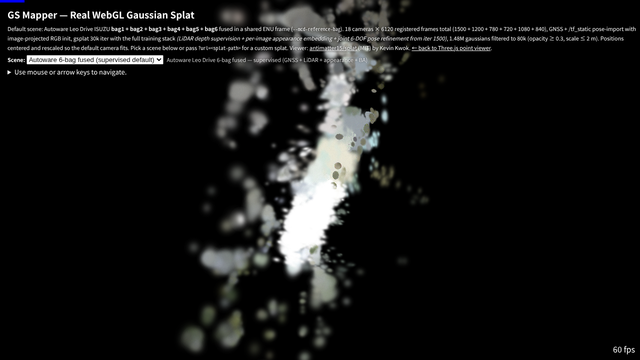
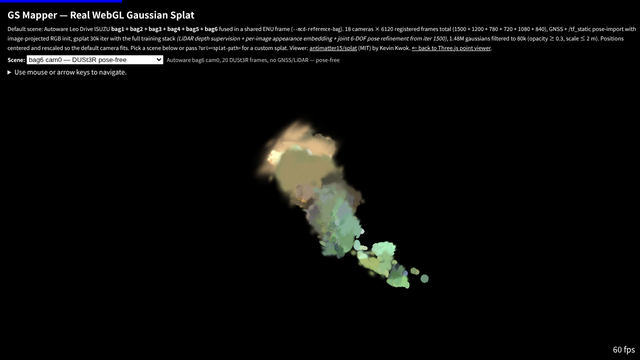
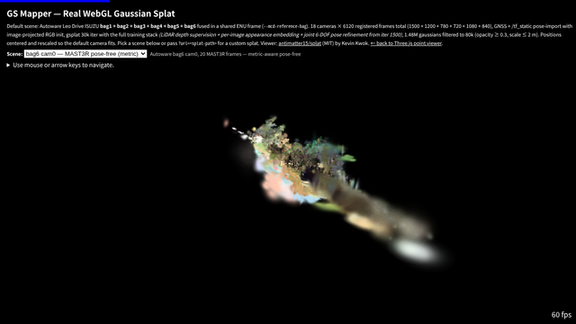
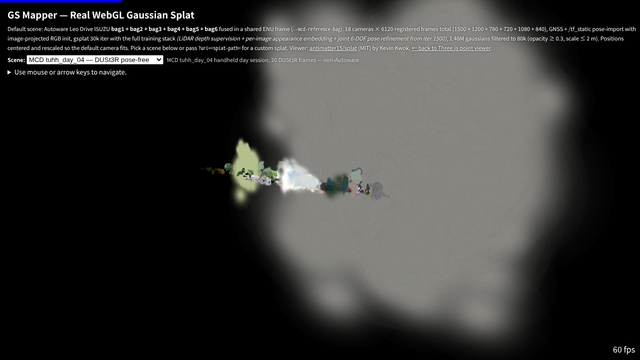
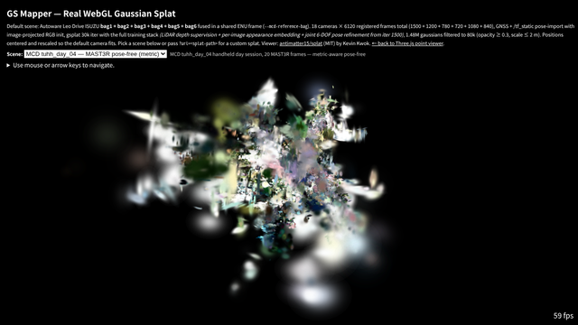

# GS Mapper

Large-scale 3D Gaussian Splatting mapper for robotics, driving, and campus-scale scenes.

One-command pipelines to go from robotics / autonomous-driving dataset images to 3DGS training to an interactive WebGL viewer.


---

ロボティクス・自動運転データセットから 3D Gaussian Splatting の学習、Web ビューアでの可視化までをワンコマンドで実行できるツールです。Python モジュール名は `gs_sim2real` のまま維持し、旧 CLI の `gs-sim2real` も互換エイリアスとして残します。

## Live Demo

GitHub Pages hosts four views of the same 6-bag Autoware Leo Drive ISUZU bundle:

| URL | Renderer | Notes |
|-----|----------|-------|
| [`/`](https://rsasaki0109.github.io/gs-mapper/) | `THREE.PointsMaterial` (WebGL) | Three.js point viewer, draws gaussian centres as soft-disc sprites. Widest browser support. |
| [`/splat.html`](https://rsasaki0109.github.io/gs-mapper/splat.html) | `antimatter15/splat` (WebGL2, CPU sort) | Lightest real splat renderer, vendored as a single JS file. |
| [`/splat_spark.html`](https://rsasaki0109.github.io/gs-mapper/splat_spark.html) | `sparkjsdev/spark` 2.0 (WebGL2, ESM) | Advanced Three.js-based renderer loaded via importmap + CDN. Experimental: may appear blank under headless browsers without a real GPU. |
| [`/splat_webgpu.html`](https://rsasaki0109.github.io/gs-mapper/splat_webgpu.html) | `shrekshao/webgpu-3d-gaussian-splat-viewer` (WebGPU, GPU radix sort) | True WebGPU: compute-shader preprocess + radix sort per frame. Requires Chrome 113+, Edge 113+, or Safari TP with WebGPU enabled. |

`splat.html` ships a scene picker that toggles between the supervised demo and four pose-free variants. Each splat is a 400k-gauss / 12.8 MB antimatter15 binary trained by the pipeline in this repo.

| Scene | Preview | Pipeline |
|-------|---------|----------|
| Autoware 6-bag fused (supervised default) | [](https://rsasaki0109.github.io/gs-mapper/splat.html?url=assets/outdoor-demo/outdoor-demo.splat) | GNSS + `/tf_static` + LiDAR-seeded COLMAP, image-projected RGB init, gsplat 30-50k iter, LiDAR depth + appearance + 6-DOF BA |
| bag6 cam0 — DUSt3R pose-free | [](https://rsasaki0109.github.io/gs-mapper/splat.html?url=assets/outdoor-demo/outdoor-demo-dust3r.splat) | 20 image-only frames → DUSt3R pointmap + global align → gsplat 3k iter |
| bag6 cam0 — MAST3R pose-free (metric) | [](https://rsasaki0109.github.io/gs-mapper/splat.html?url=assets/outdoor-demo/bag6-mast3r.splat) | Same 20 frames → MAST3R sparse global alignment → gsplat 3k iter. Metric-scale, 20/20 non-degenerate poses |
| MCD tuhh_day_04 — DUSt3R pose-free | [](https://rsasaki0109.github.io/gs-mapper/splat.html?url=assets/outdoor-demo/mcd-tuhh-day04.splat) | 20 color frames of a non-Autoware MCD day handheld session → DUSt3R → gsplat 3k iter |
| MCD tuhh_day_04 — MAST3R pose-free (metric) | [](https://rsasaki0109.github.io/gs-mapper/splat.html?url=assets/outdoor-demo/mcd-tuhh-day04-mast3r.splat) | Same frames → MAST3R → gsplat 3k iter. Matrix completes {bag6, MCD} × {DUSt3R, MAST3R} |

The supervised default uses the full MCD pose-import stack. Pose-free variants use the pipeline you can invoke yourself with `gs-mapper photos-to-splat --preprocess dust3r` or `--preprocess mast3r`.

GitHub Pages is deployed by [`.github/workflows/pages.yml`](.github/workflows/pages.yml) on `push` to `main`.

## Concept

```
Images --> Preprocessing --> 3DGS Training --> Web Viewer
  |          (COLMAP /        (gsplat /        (Three.js
  |           DUSt3R / MCD    nerfstudio)      + antimatter15/splat)
  |           pose-import)
  |
  +-- DUSt3R (pose-free, image-only, bundled)
  +-- CoVLA (driving)
  +-- MCD (campus)
  +-- Autoware Leo Drive ISUZU bags (outdoor driving)
```

## Supported Datasets

| Dataset | Type | Description | Pose |
|---------|------|-------------|------|
| [DUSt3R](https://github.com/naver/dust3r) | Pose-free 3DGS (bundled) | Pairwise pointmap network + PointCloudOptimizer global aligner, feeds into our gsplat trainer | Not required |
| [GGRt](https://github.com/lifuguan/GGRt_official) | Pose-free 3DGS (reference only) | Feed-forward generalizable renderer; upstream needs `diff-gaussian-rasterization-modified` (custom CUDA extension) and outputs gaussians in a non-PLY format. Not integrated in this repo — use `--preprocess dust3r` instead. | Not required |
| [CoVLA](https://github.com/tier4/CoVLA) | Driving scenes | Large-scale driving dataset with front camera images | COLMAP |
| [MCD](https://mcdviral.github.io/) | Campus rosbags | Multi-campus outdoor scenes with stereo, LiDAR, IMU | COLMAP / GNSS + `/tf_static` pose-import |
| Autoware Leo Drive ISUZU | Outdoor driving rosbag | Public multi-camera + LiDAR + GNSS/INS bags from Autoware Foundation | GNSS + `/tf_static` pose-import (see `configs/datasets.yaml`) |

## Installation

```bash
git clone https://github.com/rsasaki0109/gs-mapper.git
cd gs-mapper
pip install -e ".[dev]"
```

For nerfstudio backend:
```bash
pip install -e ".[nerfstudio]"
```

For gsplat backend:
```bash
pip install -e ".[gsplat]"
```

## Demo App

A browser-based Streamlit interface is available for the full 3DGS pipeline
(image upload, COLMAP preprocessing, training, 3D viewer, export).

```bash
pip install -e ".[app]"
streamlit run app.py
```

The app opens at `http://localhost:8501` with a sidebar for pipeline settings
and tabs for each stage of the workflow.

## GitHub Pages 3DGS Viewer

Export a trained PLY as a static scene bundle:

```bash
gs-mapper export \
  --model outputs/train/point_cloud.ply \
  --format scene-bundle \
  --output docs/assets/my-scene \
  --bundle-asset-format binary \
  --scene-id my-scene \
  --label "My Scene"
```

To publish the same PLY into the real WebGL splat viewer (`docs/splat.html`):

```python
from gs_sim2real.viewer.web_export import ply_to_splat

ply_to_splat(
    "outputs/train/point_cloud.ply",
    "docs/assets/my-scene/my-scene.splat",
    max_points=60000,
    normalize_target_extent=30.0,
    min_opacity=0.5,
    max_scale=2.0,
)
```

Open `https://<pages>/splat.html?url=assets/my-scene/my-scene.splat` after deploy.

## Bring Your Own Photos (one-shot, pose-free)

Drop a folder of JPG/PNG frames in, get a `.splat` out. Uses DUSt3R for
pose estimation (no COLMAP / GNSS / LiDAR required) and gsplat for
training. The resulting file is the same 32-byte-per-gauss format that
[`docs/splat.html`](https://rsasaki0109.github.io/gs-mapper/splat.html)
renders directly, so you can preview it locally or drop it into
`docs/assets/...` to ship as a Pages demo.

```bash
# Ensure a local DUSt3R clone is reachable (default /tmp/dust3r)
git clone --recursive https://github.com/naver/dust3r /tmp/dust3r
cd /tmp/dust3r && mkdir -p checkpoints && \
  wget -P checkpoints https://download.europe.naverlabs.com/ComputerVision/DUSt3R/DUSt3R_ViTLarge_BaseDecoder_512_dpt.pth
cd -

# One-shot: photos -> .splat (DUSt3R + gsplat + export all in one)
gs-mapper photos-to-splat \
    --images ./my_photos \
    --output outputs/my_photos_splat \
    --num-frames 20 \
    --iterations 3000
# writes outputs/my_photos_splat/my_photos.splat
```

Or if you already have a trained PLY and just need the splat format:

```bash
gs-mapper export \
    --model outputs/my_train/point_cloud.ply \
    --format splat \
    --output outputs/my_scene.splat \
    --max-points 400000 \
    --splat-normalize-extent 17.0 \
    --splat-min-opacity 0.02 \
    --splat-max-scale 2.0
```

Preview locally with `python -m http.server` from the repo root and open
`http://localhost:8000/docs/splat.html?url=<path-to-splat>`.

## Outdoor pipeline quickstart (Autoware Leo Drive)

Download a public bag, preprocess with pose-import + image-projected RGB + LiDAR depth maps, train with depth supervision:

```bash
python3 scripts/download_datasets.py --dataset autoware_leo_drive_bag2 --dest data/

gs-mapper preprocess \
  --images data/autoware_leo_drive_bag2 \
  --output outputs/bag2 \
  --method mcd \
  --image-topic "/lucid_vision/camera_0/raw_image,/lucid_vision/camera_1/raw_image,/lucid_vision/camera_2/raw_image" \
  --lidar-topic /sensing/lidar/concatenated/pointcloud \
  --imu-topic /sensing/imu/imu_data \
  --gnss-topic /gnss/fix \
  --mcd-seed-poses-from-gnss \
  --mcd-tf-use-image-stamps \
  --mcd-export-depth \
  --extract-lidar \
  --max-frames 400 --every-n 1 \
  --matching sequential --no-gpu

gs-mapper train --data outputs/bag2 --output outputs/bag2_train \
  --method gsplat --iterations 50000 \
  --config configs/training_depth_long.yaml
```

### Multi-bag fusion

Preprocess additional bags with a shared ENU origin (reuse the first bag's `pose/origin_wgs84.json`), then merge the sparse models into one COLMAP input:

```bash
gs-mapper preprocess \
  --images data/autoware_leo_drive_bag4 --output outputs/bag4 \
  --method mcd --mcd-seed-poses-from-gnss --mcd-tf-use-image-stamps \
  --mcd-export-depth --mcd-reference-bag outputs/bag2 ...

python3 scripts/merge_mcd_sparse.py \
  --inputs outputs/bag2 outputs/bag4 --tags bag2 bag4 \
  --output outputs/fused --include-depth

gs-mapper train --data outputs/fused --output outputs/fused_train \
  --method gsplat --iterations 30000 --config configs/training_appearance.yaml
```

The live demo is trained on a 5-bag fusion (bag1+2+3+4+6, 15 cameras, 5040 registered frames, 1.43M Gaussians).

See `docs/plan_outdoor_gs.md` for the detailed outdoor pipeline handoff (status, blockers, known-good conditions).

Then either:

- add `docs/assets/my-scene/scene.json` to `docs/assets/scenes.json` so it appears in the default viewer tab list
- or open it directly with `https://<user>.github.io/gs-mapper/?sceneManifest=assets/my-scene/scene.json`

The GitHub Pages viewer also accepts direct exported `.json` / `.bin` point
assets through the `Load Asset` button in `docs/index.html`.

The public demo tabs in `docs/assets/` are regenerated from the repo gallery
with:

```bash
python3 scripts/build_pages_gallery_scenes.py
```

If the live site still shows the old content after merge, check the latest
`Deploy to GitHub Pages` action run and wait for that deployment to complete.

## Prototype Apps

This repository now also hosts browser-first creative prototypes built on top of
Gaussian splat worlds.

- `projects/` contains Unity-native experiments such as DreamWalker.
- `apps/` contains browser-native experiences such as DreamWalker Live.
- `shared/` contains code shared across prototypes.
- `docs/prototypes/dreamwalker-live.md` documents the streamer/photo/browser residency direction.
- `docs/prototypes/dreamwalker-robotics.md` documents the sibling robotics simulation direction.
- `gs-sim2real robotics-node` provides a ROS2-side scaffold that consumes DreamWalker relay topics.
- `configs/robotics/dreamwalker_zones.sample.json` is a starter semantic-zone / costmap config for ROS2-side navigation experiments.

## Experiment-Driven Development

This repository now keeps a small stable core and a discardable experiment lab
for seams such as localization alignment, render backend selection, localization estimate import, localization review bundle import, query cancellation policy, query coalescing policy, query error mapping, query source identity, query transport selection, query request import, query queue policy, query timeout policy, query response build, live localization stream import, route capture bundle import, and sim2real websocket protocol import.

- [docs/experiments.md](docs/experiments.md) tracks the latest side-by-side comparison.
- [docs/decisions.md](docs/decisions.md) records why strategies were kept or deferred.
- [docs/interfaces.md](docs/interfaces.md) defines the minimum stable interface that production code may depend on.

Refresh the comparison and regenerate those docs with either experiment command:

```bash
gs-sim2real experiment-localization-alignment --write-docs --output outputs/localization-alignment-experiment-report.json
gs-sim2real experiment-render-backend-selection --write-docs --output outputs/render-backend-selection-experiment-report.json
gs-sim2real experiment-localization-import --write-docs --output outputs/localization-estimate-import-experiment-report.json
gs-sim2real experiment-query-transport-selection --write-docs --output outputs/query-transport-selection-experiment-report.json
gs-sim2real experiment-query-request-import --write-docs --output outputs/query-request-import-experiment-report.json
gs-sim2real experiment-query-cancellation-policy --write-docs --output outputs/query-cancellation-policy-experiment-report.json
gs-sim2real experiment-query-coalescing-policy --write-docs --output outputs/query-coalescing-policy-experiment-report.json
gs-sim2real experiment-query-error-mapping --write-docs --output outputs/query-error-mapping-experiment-report.json
gs-sim2real experiment-query-queue-policy --write-docs --output outputs/query-queue-policy-experiment-report.json
gs-sim2real experiment-query-source-identity --write-docs --output outputs/query-source-identity-experiment-report.json
gs-sim2real experiment-query-timeout-policy --write-docs --output outputs/query-timeout-policy-experiment-report.json
gs-sim2real experiment-query-response-build --write-docs --output outputs/query-response-build-experiment-report.json
gs-sim2real experiment-live-localization-stream-import --write-docs --output outputs/live-localization-stream-import-experiment-report.json
gs-sim2real experiment-route-capture-import --write-docs --output outputs/route-capture-bundle-import-experiment-report.json
gs-sim2real experiment-sim2real-websocket-protocol --write-docs --output outputs/sim2real-websocket-protocol-experiment-report.json
gs-sim2real experiment-localization-review-bundle-import --write-docs --output outputs/localization-review-bundle-import-experiment-report.json
```

## Docker

Build and run with Docker Compose (requires NVIDIA Container Toolkit):

```bash
docker compose up --build
```

The Streamlit app will be available at `http://localhost:8501`.

To run a specific command inside the container instead of the default app:

```bash
docker compose run playground gs-mapper photos-to-splat --images /workspace/my_photos --output /workspace/outputs/my_splat
```

Dataset files in `data/` and training outputs in `outputs/` are mounted as volumes, so they persist on the host.

## Quick Start

### One-shot (pose-free, just photos in -> splat out)

```bash
gs-mapper photos-to-splat --images ./my_photos --output outputs/my_splat
```

### Step-by-step

```bash
# Download a dataset (mcd, covla, autoware_leo_drive_bagN ...)
gs-mapper download --dataset mcd --dest data/

# Preprocess with COLMAP (classic path, needs well-textured overlapping views)
gs-mapper preprocess --images data/covla --output outputs/colmap --method colmap

# Or DUSt3R pose-free (bundled, handles sparse views without COLMAP)
gs-mapper preprocess --images data/covla --output outputs/colmap --method dust3r

# Train 3DGS
gs-mapper train --data outputs/colmap --output outputs/train --iterations 30000

# Export the trained PLY to the antimatter15 .splat format for docs/splat.html
gs-mapper export --model outputs/train/point_cloud.ply --format splat --output outputs/my_scene.splat
```

### Using scripts

```bash
python scripts/download_datasets.py --dataset mcd --dest data/
python scripts/run_dust3r.py --image-dir ./my_photos --output outputs/my_dust3r \
    --checkpoint /tmp/dust3r/checkpoints/DUSt3R_ViTLarge_BaseDecoder_512_dpt.pth
```

## Project Structure

```
gs-sim2real/
├── apps/                # Browser-native prototypes
├── docs/                # Prototype notes and setup docs
├── projects/            # Unity-native prototypes
├── shared/              # Shared runtime/package code
├── src/gs_sim2real/
│   ├── common/          # Config loading, download utilities
│   ├── preprocess/      # COLMAP, frame extraction
│   ├── train/           # gsplat, nerfstudio training wrappers
│   ├── viewer/          # Viser-based web viewer
│   └── cli.py           # Command-line interface
├── configs/             # Dataset and training YAML configs
├── scripts/             # Standalone helper scripts
├── tests/               # Unit tests
├── notebooks/           # Jupyter notebooks
├── data/                # Downloaded datasets (gitignored)
└── outputs/             # Training outputs (gitignored)
```

## Citation

If you use this tool in your research, please cite the relevant dataset papers:

```bibtex
@article{li2024ggrt,
  title={GGRt: Towards Pose-free Generalizable 3D Gaussian Splatting in Real-time},
  author={Li, Hao and Jiang, Yuze and Gao, Rui and Luo, Changjian and Zhang, Zhi and Shao, Dingjiang and others},
  journal={arXiv preprint arXiv:2403.10147},
  year={2024}
}

@article{arai2024covla,
  title={CoVLA: Comprehensive Vision-Language-Action Dataset for Autonomous Driving},
  author={Arai, Hidehisa and others},
  journal={arXiv preprint arXiv:2408.10680},
  year={2024}
}

@article{lim2024mcd,
  title={MCD: Diverse Large-Scale Multi-Campus Dataset for Robot Perception},
  author={Lim, Thien-Minh and others},
  journal={arXiv preprint arXiv:2403.11755},
  year={2024}
}
```

## License

MIT License. See [LICENSE](LICENSE) for details.
